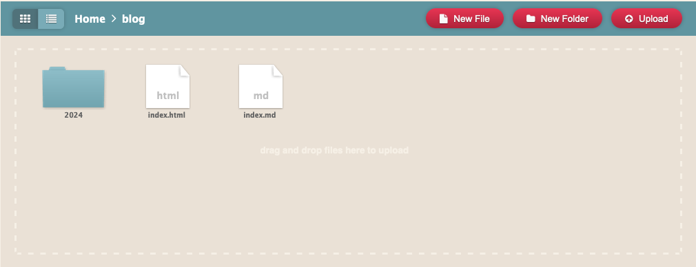

# Tutorial: Create your blog with MDZG on Neocities
<small>Dec 29, 2024</small>

This is a tutorial to create your blog with [MDZG](https://github.com/rognoni/mdzg) (Markdown Zen Garden) ⬇️🧘 on [Neocities](https://neocities.org)

[Download the ZIP](https://github.com/rognoni/mdzg/archive/refs/heads/main.zip) and upload the content (drag and drop) on Neocities and go into the **blog** folder here:



This is the folders structure:

- [blog](/blog/)
  - 2024
    - [tutorial_blog_with_mdzg](/blog/2024/tutorial_blog_with_mdzg/)
      - `index.html`
      - [index.md](/blog/2024/tutorial_blog_with_mdzg/index.md)
      - [cover.png](/blog/2024/tutorial_blog_with_mdzg/cover.png)
      - and other if you need

To share your post you have to edit these metadata in the `index.html`

```
<meta property="og:title" content="Tutorial: Create your blog with MDZG on Neocities">
<meta property="og:description" content="This is a tutorial to create your blog with MDZG (Markdown Zen Garden) ⬇️🧘 on Neocities">
<meta property="og:image" content="cover.png">
```

---

<small>

💬 [Share on Mastodon](https://mastodon.social/tags/mdzg)

</small>
